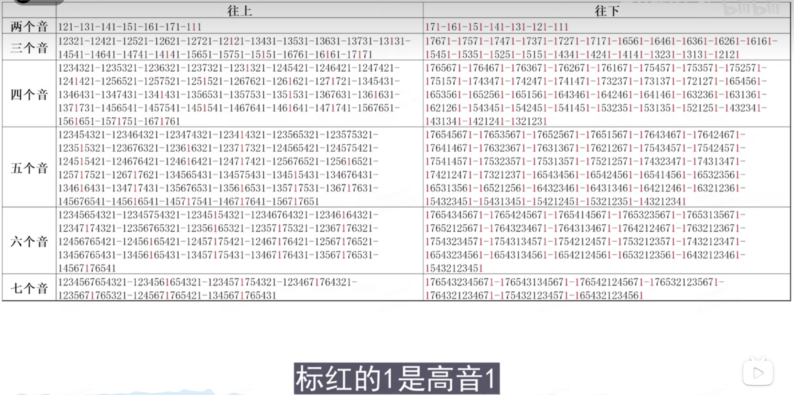
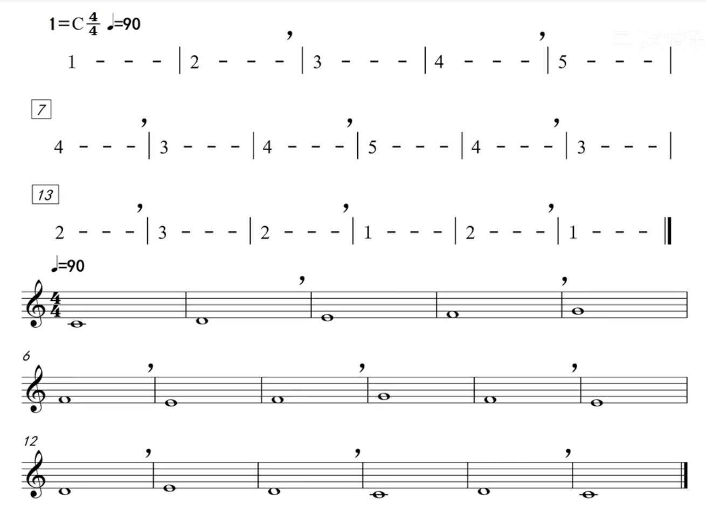
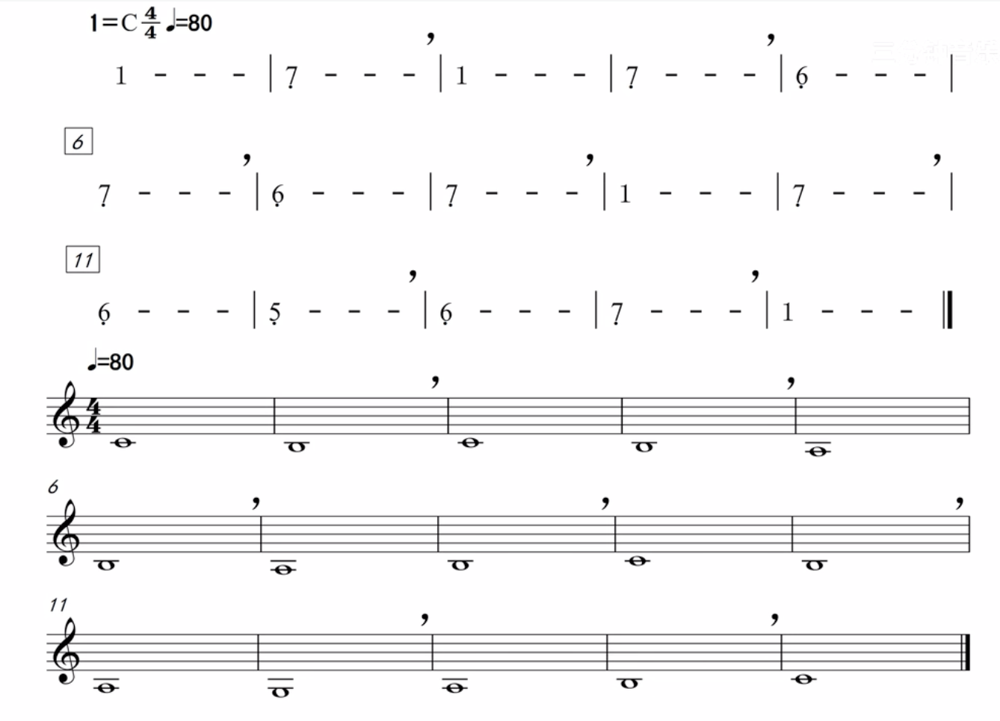
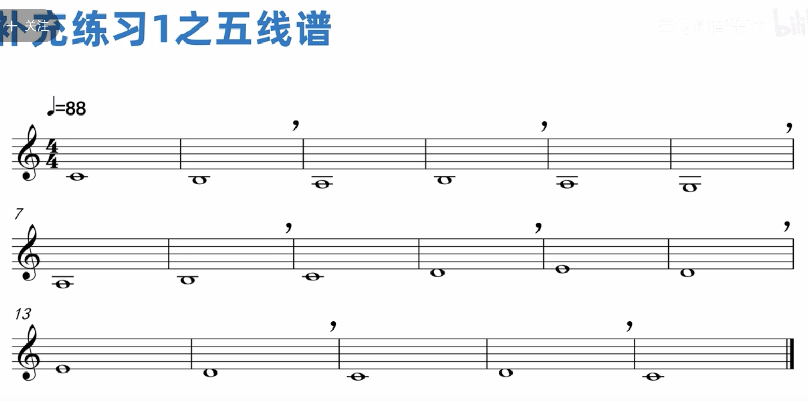
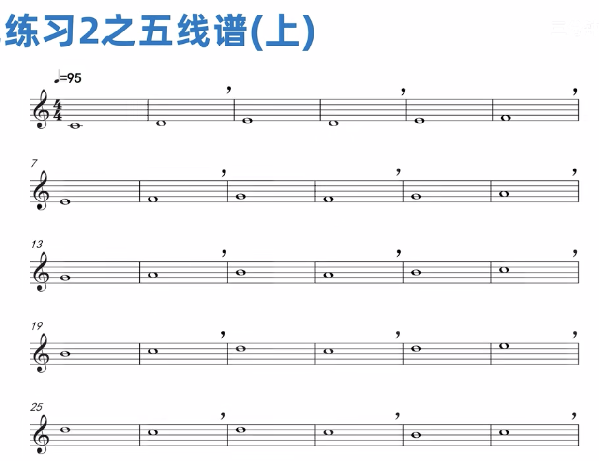
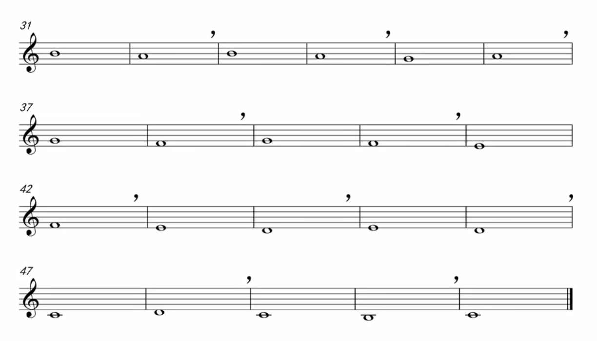
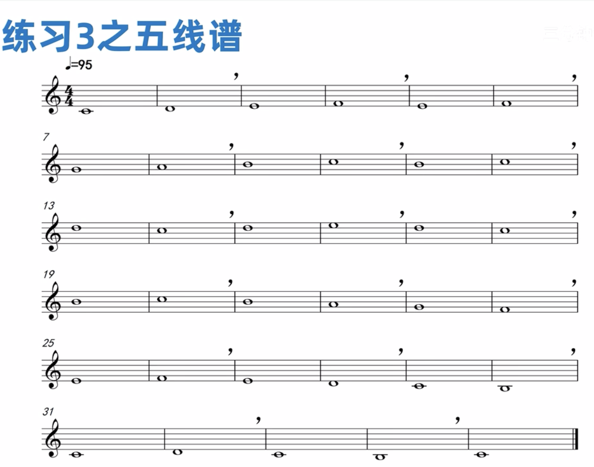

# guitar-learning

Learning the guitar

吉他的记谱，使用高音谱表。

事实上，吉他属于 __移调乐器__ ——即乐器所发出的乐音实际音高，要比记谱音高低一个八度。也就是说，目前按照五线谱记谱所对应的音位，其发出的音高是低八度的。比如说五弦三品的C音，在五线谱记谱位置上，表达的是小字1组的c1，但其演奏出的实际音高，却是小字组的c音。

## 注意事项

1. 手势问题
2. 节拍节奏（练琴一定要开着节拍器）
3. 大横按

> 下面进入真正的学习阶段

## 基础练习

1. 识谱、调音
2. 节奏（1/4, 3/4, 4/4）
3. 左右手配合
4. 爬格子
5. c调的常见和弦

## 进阶练习

1. 找一些自己喜欢的曲子（谱子）来练习，越简单的越好，这样可以不断增加你的自信心；
2. 针对性的练习一些技巧，比如击勾弦、推弦等；
3. 参看 元子老师 的[bilibili课程](https://www.bilibili.com/video/BV13T4y1q7vR/?spm_id_from=333.999.0.0&vd_source=52795eb28b272a66f3e81bb6f34faaa5)

在这个过程中 也会吸收一些到乐理知识

## 乐理

1. 乐理
音阶、音程、和弦结构、调式等， 理解很重要，最主要的多思考、多沟通；

2. 乐理与指板结合
CAGDE系统, 解锁指板

## 练耳

[从零开始学扒歌@老砍呐](https://www.bilibili.com/video/BV1V7411n7zy/?spm_id_from=333.999.0.0&vd_source=52795eb28b272a66f3e81bb6f34faaa5)

[视唱练耳合集@三分钟音乐社/3-旋律音程高低判断](https://www.bilibili.com/video/BV12G4y1T75F?p=4&vd_source=52795eb28b272a66f3e81bb6f34faaa5)

### MacOS练耳软件
- Auricula (Interval Ear Trainer)
- Better Ears Beginner
  
### 1. 模唱练习（模仿）

* （向上八度）121 131 141 151 161 171 111
* （向下八度）171 161 151 141 131 121 111
* 练习方式，先跟练模唱；然后只弹do,先唱，再弹琴检验，参照下图
  

  练习表
  

### 2. 全音符节奏与C大调自然音级的级进练习

* 级进上行练习

  

* 级进下行练习

  

* 补充练习1
  
  

* 补充练习2
  
  

  

* 补充练习3
  

* 更多请参考《视唱练耳》相关书籍中类似"C大调级进"的例子。

## 扒谱练习

@彭哲-Point吉他声学

## 编曲

